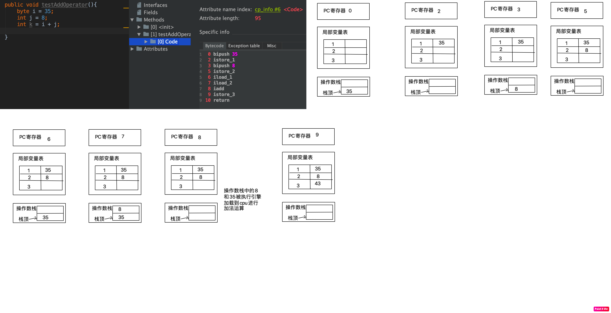

# Java虚拟机

## JDK JRE JVM 之间的关系

- JDK 包含JRE 包含JVM


## 内存与垃圾回收

### Java语言简介

- TIOBE 编程语言排行版
- Harmony 开源的JVM
- jvm可以运行多种语言的代码，只要一种语言的编译器生成的字节码文件符合jvm的规范，就可以在jvm中运行
- 自己手动写java虚拟机
- java 默认的虚拟机java hotspot virtual machine
- 三大主流虚拟机
  - hotspot
  - JRockit 没有方法区的概念
  - J9 ->IBM 没有方法区的概念
- java8的虚拟机 整合了 hotspot 和 JRockit 整合 HotRockit 但是其实大家还是叫Hotspot
- Jdk 1.7 采用了G1垃圾回收器
- Jdk9 将G1设置为默认的垃圾回收器（GC），替代CMS
- Jdk11 ZGC 发布
- Jdk12 加入RedHat 开发的Shenandoah GC openJDK中使用了这个GC

### JVM

- 执行java字节码的虚拟计算机，跨平台，垃圾回收，可靠的即时编译

- 特点

  - 一次编译到处运行
  - 自动内存回收
  - 自动垃圾回收

- java虚拟机的结构

  

  

  

  

- java 代码的执行流程

  


​	详细流程图


更详细的jvm内部结构图


- JVM指令集架构模型
  - 基于栈指令集架构
    - 设计和实现更简单，适用于资源受限的系统
    - 避开了寄存器分配的难题，使用零地址指令分配
    - 指令流中的指令大部分是零地址指令，器执行过程依赖操作栈，指令集更小，编译更容易实现
    - 不需要硬件支持，可移植性更好，更好实现跨平台
  - 基于寄存器指令集架构
    - X86的二进制指令集
    - 完全依赖硬件，可移植性差
    - 性能更好
    - 花费更少的指令去完成一项操作
    - 大部分情况下，基于寄存器架构的指令往往是一地址指令，而地址指令和三地址指令为主
- 栈指令集架构的特点
  - 跨平台，指令集小，指令多，执行性能比寄存器差

- jvm 的生命周期
  - 虚拟机启动
    - 是通过引导类加载器（bootstrap class loader） 创建一个初始类（initial class）来完成的，这个类是由虚拟机的具体实现来指定的
  - 虚拟机执行
    - 一个运行中的java虚拟机有着一个清晰的任务，执行Java程序
    - 程序的开始执行时他才运行，程序结束时他就停止
    - 执行一个所谓的java程序的时候，真真正正在执行一个叫java虚拟机的进程
  - 虚拟机退出
    - 程序正常执行结束
    - 执行过程中遇到了异常或错误而终止
    - 由于操作系统出现错误导致java虚拟机进程终止
    - 某个线程调用了System.exit(),或者Runtime类的halt方法，并且java安全管理器也允许这次exit和halt操作
      - Runtime 采用的就是单例模式模式的饿汉式
    - 除此之外，JNI（Java Native Interface）规范描述了用JNI Invocatiom API 来加载或卸载java虚拟机时，java虚拟机退出的情况


- jvm 发展历程
  - jdk1.0 ClassicVM 第一款商用虚拟机，jdk1.4淘汰，这款虚拟机只提供了解释器，没有提供JIT编译器，如果想使用JIT，只能外挂一个JIT，但是这样就只能执行其中一个，不能解释器和JIT同时工作
  - Jdk1.2 Exact VM
    - Exact Memory Management 准确内存管理，虚拟机可以知道内存中某个位置的数据具体式什么类型
    - 具备了高性能虚拟机的雏形
      - 热点探测
      - 编译器与解释器混合工作模式
    - 只是Solaris平台短暂使用，其他平台还是classic vm，最终被hotspot替代
  - jdk1.3 采用hotspot VM 
    - hotspot 就是热点代码探测技术
      - 通过计数器找到最具编译价值的代码，触发即时编译或栈上替换
    - 通过编译器和解释器协同工作，在最优话的程序响应时间与最佳执行性能中取得平衡
  - BEA JRockit
    - 不太关心程序的启动速度，因此JRockit内部不包含解释器实现，全部代码都靠编译器编译后执行
    - JRockit 是速度最快的虚拟机，里面有MissionControl 套件可以监控应用程序 【JMC】
  - IBM J9
  - JAVA ME 采用的虚拟机 CDC/CLDC Hotspot
  - Azul VM 运行在特定的硬件
    - 2010 年发布了不基于硬件的Zing VM，可以通用在X86架构的平台上
  - Liquid VM 随着JRockit 的暂停，也就暂停了
  - Apache Harmony 兼容JDK1.5 和 JDK1.6，最后在andriod 中被采用得比较多
  - Microsoft JVM，只能在windows 下运行
  - TaobaoJVM 基于openJDK 定制的ali虚拟机，
    - 采用了off-heap，将生命周期比较长的对象从heap中移除，提高了GC的效率
    - GCIH （GC invisible heap）对象能在多个java虚拟机内共享
  - Dalvik VM
    - Google 开发，应用与andriod 系统 5.0 之前，5.0 之后用ART VM
  - Graal VM
    - Oracle 虚拟机
    - 跨语言全栈虚拟机

### 常用的命令集

- 反编译获取字节码文件
  - javaP -v xxx.class
- 查看执行的进程
  - jps


### 比较好理解的比喻

- jvm 中的解释器和JIT的形象比喻
  - 比如你要从 杭州湘湖到西湖
    - 你可以选择步行去（解释器的方式），也可以选择做公交车的方式（JIT）
      - 步行你可以马上就出发（jvm马上就可以执行代码），但是坐公交你就得等公交（等JIT将class编译成字节码再执行）
    - 在jdk1.0 版本中你只能选择一种方式，你要么一路走到西湖，要么你一路做公交到西湖，在公交换乘点需要换乘其他公交的时候你只能等，不能选则走到其他站点去换乘
    - 在后面的jdk版本中换乘了hotspot ，走路和坐公交可以结合了


## 类加载器子系统

### 基本介绍


- 类加载器子系统负责从文件系统或网络中加载class文件，class文件在文件开头有特定的文件标识
- ClassLoader 只负责class文件的加载，是否可以执行由Exection Engine 决定
- 加载的类信息存放于一块被称之为方法区的内存空间，出了类的信息外，方法区还会存放运行时常量池信息，可能还包括字符串等字面量和数字常量（这部分常量信息时class文件中常量池部分的内存映射）

### 加载

- 通过一个类的全限定名获取定义此类的二进制字节流
- 将这个字节流所代表的静态存储结构转化为方法区的运行时数据结构
  - jdk1.7 之前方法区叫做永久代，jdk1.8 叫做元空间
- 在内存中生成一个代表这个类的对象java.lang.Class,作为方法区这个类的各种数据的访问入口
- 字节码文件的来源
  - 本地系统中class文件
  - 压缩包 jar 和 war
  - 网络
  - 运行时计算生成，动态代理
  - 由其他文件生成，jsp应用
  - 从专业的数据库中提取，class文件，比较少见
  - 从加密文件中获取，典型的防class文件反编译的保护措施

### 链接

#### 验证

- 确保class文件的字节流中包含信息符合当前虚拟机要求，保证加载过程的正确性，不会危害虚拟机自身安全
- 主要包含四种验证
  - 文件格式验证 比如都以 CA FE BA BE 开头
  - 元数据验证
  - 字节码验证
  - 符号引用验证

#### 准备

- 为成员变量赋初始化值：数值类型 为0，浮点型为0.0 ，boolean为false ，引用对象为null
- 不包含final修饰的static，因为final在编译的时候就会分配了，准备阶段会显示初始化
- 不包含不会为局部变量分配初始化

#### 解析

- 常量池中的符号引用转变为直接引用
- 解释操作往往会伴随着jvm执行初始化之后再执行
- 符号引用就是用一组符号来描述所引用的目标，符号引用的字面量形式明确定义在<Java虚拟机规范>的class文件格式中，直接引用就是直接指向目标的指针，相对便宜量或一个间接定位到目标的句柄
- 解析动作主要针对类的接口，字段，类方法，接口方法，方法类型等，对应常量池中的
  - CONSTANT_Class_info 
  - CONSTANT_Fieldref_info
  - CONSTATN_Mehodref_info

### 初始化

- 就是执行类构造器方法clinit的过程，这个方法不需要我们定义，javac编译器自动收集类中的所有变量赋值动作和静态代码块中的语句合并而来，构造器方法指令的顺序就是代码的顺序
- clinit 不同于类的构造器，如果类中没有静态的成员变量和静态的代码块是不会生成clinit方法的，但是类的构造器时存在的，就是init方法
- 如果该类有父类，那么先执行父类的clinit
- 虚拟机必须保证一个类的clinit方法在多线程下被同步加锁


### 类加载器

- 分类

  - 引导类加载器 BootstrapClassLoader
  - 自定义类加载器 User-Defined ClassLoader

- 主要包含下面的加载器，他们之间是有等级关系

  - BootstrapClassLoader【使用C和C++来实现的】
  - ExtensionClassLoader【其实属于自定义类加载器】
  - SystemClassLoader【其实属于自定义类加载器】
  - User Defined ClassLoader

- 启动类加载器BootstrapClassLoader

  - c/c++ 实现，在jvm内部
  - 加载java核心类库的class文件，不继承ClassLoader
  - 加载扩展类加载器类和系统类加载器类
  - 只加载包名为java,javax,sun下面的类

- 扩展类加载器 ExtClassLoader

  - 使用java语言编写
  - 是Launch的内部类，父类加载器为启动类加载器
  - 从java.ext.dirs系统属性指定的目录中加载类库，或从JDK安装目录的jre/lib/ext子目录下加载类库，如果用户创建的jar放在此目录下，也会自动由扩展类加载器加载

- 应用程序类加载（系统类加载器）AppClassLoader

  - java语言编写
  - 派生于ClassLoader
  - 父类加载器为ExtClassLoader
  - 负责加载环境变量classpath或系统属性java.class.path指定路径下的类库
  - 该类加载器是程序中默认的类加载器，一般来说，java应用程序的类都是由它来完成加载的
  - 通过ClassLoader#getSystemClassLoader方法可以获取到该类加载器

- 用户自定义类加载器

  - 什么时候自定义类加载器
    - 隔离加载类
    - 修改类加载方式
    - 扩展加载源
    - 防止源码泄露
  - 如果自定义类加载器
    - 继承java.lang.ClassLoader,实现自己的类加载器
    - 1.2 之前要重写loadClass()，1.2 之后实现findClass()
    - 如果没有特别复杂的需求，可以直接继承URLClassLoader类。这样就可以避免自己去编写findClass方法和获取字节码流的方式

- 双亲委派机制

  - jvm 对class文件采用的是按需加载，加载某个类采用的是双亲委派机制，即把请求交由父类处理，就是一种任务委派模式

  - 双亲委派的原理

    - 如果一个类加载器需要加载一个类，但是它不会立即加载，而是给父类加载器去加载，如果父类加载器还存在父类加载器，继续向上委托，一次递归，直到到达最顶层的类加载器，如果父类加载器可以完成类的加载，则返回类，如果不能加载，则子类加载器才会加载

  - 优势

    - 避免类的重复加载
    - 保护程序安全，防止核心API被篡改
      - Java.lang.String 自定义类是这样的不会被加载，而是加载核心API下的String类
      - java.lang.HcuteStart 自定义类是这样的会报错，包不合法
        - 因为会交给启动类加载器加载，此时启动类加载器发现是java.lang包下的，属于自己管辖的范畴，但是找不到该类，所以报错

  - 沙箱安全机制

    - 对核心API的保护，就是沙箱安全机制

      

### 其他

- JVM 中表示两个class对象是否为同一个类的两个必要条件
  - 类的完整类名必须一致，包括包名
  - 加载这个类的ClassLoader也必须是相同的
- 如果一个类是由用户类加载器加载的，那么jvm会将这个类加载器的一个引用作为类信息的一部分保存在方法区中，当解析到一个类型到另一个类型的引用的时候，jvm需要保证这两个类型的类加载器是相同的
- java程序对类的使用方式分为：主动使用和被动使用
  - 主动使用
    - 创建类的实例
    - 访问某个类或接口的静态变量，或着对该静态变量赋值
    - 调用类的静态方法
    - 反射 Class.forName("hoo.hcute.ClassLoaderTest")
    - 初始化一个类的子类
    - Java虚拟机启动时被标明为启动类的类
    - jdk7 开始提供动态语言支持
      - java.lang.invoke.MethodHandle实例的解析结果REF_getStatic、REF_putStatic、REF_invokeStatic句柄对应类没有初始化，则初始化
  - 除了以上都是被动使用，被动使用不会导致类的初始化


## 运行时数据区

### 数据区结构


- 堆，方法区（元数据区和CodeCache）是线程共享的区域
- 本地方法栈、虚拟机栈、程序计数器是线程独享区域

### 线程

- JVM的线程和操作系统本地的线程是直接映射
  - 当线程发生未处理的异常，jvm线程会终止，但是本地线程会判断当前线程是不是最后一个非守护线程，如果是，那就终止JVM
- JVM中的主要线程【可以使用jconsole查看】
  - 虚拟机线程
  - 周期任务线程
  - GC线程
  - 编译线程
  - 信号调度线程

​	

### 程序计数器（program Counter Register）

- 介绍

  - 作用

    - 用来存储指向下一条指令的地址，也即将要执行的指令代码。由执行引擎读取下一条指令
    - 和线程的生命周期一致
    - 如果本地方法在执行，此时程序计数器指向的地址是undefine
    - 不会出现OutOfMemoryError
      - GC和OOM
        - 栈没有GC，但是可能会出现OOM

  - 代码示例

    

- 面试问题
  - 使用PC寄存器存储字节码指令地址有什么用呢？
    - JVM字节码解释器就需要通过改变PC寄存器的值来明确下一条应该执行什么样的字节码指令
  - 为什么使用PC寄存器记录当前线程的执行地址呢？
    - 因为CPU是在多个线程之间进行切换的，如果切换回来，需要知道当前线程执行到哪里了
  - PC寄存器为什么要设计成线程私有的
    - 如果不是私有的，当CPU切换成原来执行的线程的时候就找不到执行的位置了，因为已经被新的线程覆盖了，所以必须是线程私有的


## 虚拟机栈

### 概述

- 出现背景

  - 由于java的跨平台性，所以java的指令都是根据栈来设计的，而不能使用寄存器来设计，因为不同的CPU机构不同

- 优点：

  - 跨平台
  - 指令集小【8bit】
  - 编译器容易实现

- 缺点

  - 性能下降
  - 实现同样的功能需要更多的指令

- 什么是java虚拟机栈

  - java virtual machine stack ，早期也叫java栈，每个线程在创建的时候都会创建一个虚拟机栈，其内部保存一个个栈帧（stack Frame）【一个栈帧就对应一个java方法】，对应着一次次的java方法调用

  - 是线程私有的，和线程同生命周期

    

  - 作用

    - 主要管理java程序的运行，它保存方法的局部变量，部分结果，并参与方法的调用和返回

  - 优缺点

    - 栈是一种快速有效的分配存储的方式，访问速度仅次于程序计数器
    - jvm直接对java栈的操作只有两个
      - 每个方法执行，伴随着进栈
      - 每个方法执行结束出栈
    - 对于栈不存在垃圾回收问题，但是存在OOM的

  - 栈可能抛出的异常

    - java虚拟机规范允许java栈的大小是动态或者是固定不变的
      - 如果是固定大小的虚拟机栈，那每个线程的java虚拟机栈容量可以在线程创建的时候独立选的，如果线程请求分配的栈容量超过了java虚拟机栈允许的最大容量，java虚拟机将会抛出一个StackOverflowError 异常
      - 如果是动态扩展的，并且在尝试扩展的时候无法申请到足够的内存，或者在创建新线程是没有足够的内存区创建对应的虚拟机栈，那么java虚拟机将会抛出OutOfMemoryError异常

  - 设置栈的大小

    - -Xss 设置栈最大的大小
      - Xss1m
      - Xss256k
      - Xss1024  [这个单位是byte] 

### 栈的存储单位-栈帧

- 栈的运行原理
  - 栈帧和方法是一一对应
  - 栈帧就是一个内存区块，是一个数据集，维系着方法执行过程中的各种数据信息
  - push 和 pop是最基本的操作
  - 在一个时间点上只有一个活动的栈帧，就是当前栈帧，也就是当前方法，该方法所在的类就称之为当前方法
  - 执行引擎多有的字节码指令只针对当前的的栈帧
  - 该方法调用了其他方法，其他方法会入栈，放到栈顶位置
  - 不同线程中包含的栈帧是不允许相互引用的，不可能在一个栈帧中引用另外一个栈帧
  - 当前方法调用了其他方法，方法返回之际，当前栈帧会传回此方法的返回结果给前一个栈帧，接着，虚拟机回丢弃当前栈帧，使得前一个栈帧成为当前栈帧
  - java 方法的返回有两种
    - 一种return
    - 一种抛出我们没有处理的异常
- 栈帧内部结构
  - **局部变量表** local variables
  - **操作数栈** operand stack
  - 动态链接 dynamic linking（或指向运行时常量池的的方法引用）
  - 方法返回地址 return address (或方法正常退出或异常退出的定义)
  - 一些附加信息

### 局部变量表

- 也称之为局部变量数组或本地变量表

- 定义为一个数字数组，主要存储方法的参数，定义在方法内的局部变量，这些数据类型包含基本数据类型、引用数据类型、returnAddress类型

- 栈中的数据不存在线程安全问题

- 局部变量表所需要的大小是在编译期就确定下来了，保存在Code 属性的maximum local variable数据项中，在运行期间是不会改变局部变量表的大小的

- 方法嵌套调用的次数由栈的大小决定，一般来说，栈越大，方法嵌套调用的次数越多，对于一个函数而言，他的参数和局部变量越多，使得局部变量表膨胀，它的栈就越大，以满足方法调用所需传递的信息增大的需求，进而函数调用就会占用更多的栈空间，导致嵌套调用次数就会减少

- 局部变量表中的变量值在当前方法调用中有效，在方法执行时，虚拟机通过使用局部变量表完成参数值到参数变量列表的传递过程，当方法调用结束后，随着方法栈帧的销毁，局部变量也会随之销毁

- Slot 槽

  - 局部变量表的基本存储单元

  - 局部变量表的是一个数值类型的数组

  - 在局部变量表里，32位以内的类型只占一个slot【包含returnAddress】，64位的类型【double float】需要占两个slot

    - byte、short、char 在存储前会被转成int，boolean也会被转成int，0 表示false ，1表示true
    - 引用类型也是占一个slot ，因为它存储的是引用对象的地址
    - long和double占两个slot

  - jvm会为局部变量表中的每一个slot都分配一个访问索引，通过这个索引可成功访问到局部变量表中的制定的局部变量的值

  - 当一个实例方法被调用的时候，它的方法参数和方法体内部定义的局部变量将会按照顺序复制到局部变量表中的每一个slot上

  - 如果需要访问一个64位的局部变量值的时候，只需要使用起始索引即可

    

  - 如果当前帧是由构造方法或者实例方法创建的，那么该对象引用this将会存放在index为0的slot处，其余的参数按照参数表顺序继续排列

    - 静态方法中为什么不能使用this

      - 因为静态方法中的局部变量表中没有this变量

      

    

  - slot 重复使用

    - 栈帧中的局部变量表中的槽位是可以重用的，如果一个局部变量过了其作用域，那么在其作用域之后申明的新的局部变量就很有可能会重复用过期局部变量的槽位，从而达到节省资源的目的

      


- 静态变量和局部变量的对比

  ```java
  /*
          变量分类
              按照数据类型分为
                  基本数据类型
                  引用数据类型
              按照在类中申明的位置
                  成员变量：在使用前都经历过默认初始化赋值
                      类变量 static 修饰,在Linking的prepare阶段：给类变量默认赋值 ---> initialize 阶段 给类变量和静态代码块赋值
                      实例变量 随着对象的创建会在堆空间中会分配实例变量空间，会进行默认赋值
                  局部变量：在使用前必须要显示赋值，否则，编译不通过
  
       */
  ```

  

- 补充

  - 在栈帧中，与性能调优关系最为密切的部分就是前面提到的局部变量表，在方法执行时，虚拟机使用局部变量表完成方法的传递
  - 局部变量表中的变量也是重要的垃圾回收的根节点，只要局部变量表中直接或间接引用的对象都不会被回收

### 操作数栈 operand stack

【栈可以使用数组或者链表来实现】

- 操作数栈就是基于数组来实现的

- 每一个独立的栈帧中除了包含局部变量表，还包含一个后进先出的操作数栈，也可以称之为表达式栈

- 在方法的执行过程中，根据字节码指令，往栈中写入数据或提取数据，即入栈push和出栈pop

- 操作数栈，主要保存计算过程的中间结果，同时作为计算过程中变量临时的存储空间

- 操作数栈就是jvm执行引擎的一个工作区，当一个方法刚开始执行的时候，一个新的栈帧也会随之被创建出来，这个方法的操作数栈空的

- 每一个操作数栈都会拥有一个明确的栈深度用于存储数值，器所需要的最大深度在编译期就定义好了，保存在放放的Code属性中，为max_stack的值

- 栈中的任何一个元素都可以是任意的java数据类型

  - 32bit的类型占一个栈单位深度
  - 64bit的类型占两个栈单位深度

- 操作数栈并非采用访问索引的方式来访问数据，而是通过标准的栈操作来取数据

- 如果被调用的方法带有返回值的话，其返回值将会被压人当前栈帧的操作数栈中，并更新pc寄存器中下一条需要执行的字节码指令

  

- 操作数栈元素的数据类型必须与字节码指令的序列严格匹配，这由编译器在编译期间进行验证，同时在类加载过程中的类检验阶段的数据流分析阶段要再次验证

- jvm的解释引擎是基于栈的执行引擎，其中栈指的就是操作数栈

### 代码追踪

- 操作数栈，PC寄存器和局部变量表的追踪

  

- i++ 和 ++i

### 栈顶缓存技术 Top of stack cashing

将栈顶元素全部缓存在屋里cpu的寄存器中，以降低对内存的读/写次数，提升执行引擎的执行效率


### 动态链接 Dynamic Linking

【有些地方将动态链接，方法返回地址和一些附加信息称之为帧数据区】

- 大部分字节码指令都需要进行常量池的访问
- 每一个栈帧内部都包含一个指向运行时常量池中该栈帧所属方法的引用。包含这个引用的目的就是为了支持当前方法的代码能够实现动态链接，比如 invokdedynamic指令。
- 在java源文件在编译到字节码文件中时，所有的变量和方法引用都作为符号引用保存在class文件的常量池里，比如：描述一个方法调用了另外的其他方法时，就是通过常量池中指向方法的符号来表示的，那么动态链接的作用就是为了将这些符号引用转换为调用方法的直接引用
  - 为什么需要常量池
    - 提供一些符号和常量，便于指令的识别


### 方法调用：解析与分派

- jvm中，将符号引用转换为调用方法的直接引用与方法的绑定机制相关
- 静态链接 - 早期绑定
  - 当一个字节码文件被装载进jvm内部是，如果被调用的目标方法在编译期可知，且在运行期保持不变，这种情况下将调用方法的符号引用转换为直接引用的过程叫做静态链接
- 动态链接 - 晚期绑定
  - 如果被调用的方法在编译期无法被确定下来，只有在运行期才能确定下来，这种情况下将调用方法的符号引用转换为直接引用的过程叫动态引用
- 由于高级语言的出现，出现了多态的特性，自然也就具备了早期绑定和晚期绑定
- 方法中的方法都具有虚函数的特征，C++中的虚函数需要用vitrual修饰，如果你不想这个方法拥有虚函数的特征时，则可以用关键字final来标记这个方法。
- 虚方法和非虚方法
  - 非虚方法
    - 如果在编译期间就确定了具体的调用版本，这个版本在运行时不可变，包含，静态方法，final方法，私有方法，实例构造器，父类方法都是非虚方法
  - 虚方法
    - 上面非虚方法之外的方法
  - jvm方法调用的指令
    - invokestatic **调用静态方法**
    - invokespecial **调用init方法，私有方法，父类方法，解析阶段确定唯一方法版本**
    - invokevirtual 调用所有虚方法 【final 方法也是这个指令，但是是非虚方法】
    - Invokeinterface 调用接口方法
    - InvokeDynamic 动态解析处需要调用的方法，然后执行，jdk1.7 之后


### 方法返回地址


### 一些附加信息


### 栈的相关面试题


